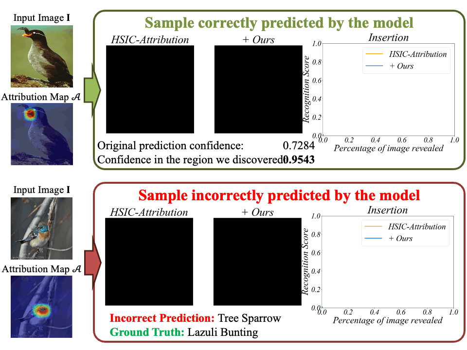

# Less is More: Fewer Interpretable Region via Submodular Subset Selection




## Environment

```python
opencv-python
opencv-contrib-python
mtutils
```

## 1. Generate saliency map

First, the priori saliency maps for sub-region division needs to be generated.

```
CUDA_VISIBLE_DEVICES=0 python generate_explanation_maps.py
```

Don't forget to open this file and revise the variable `mode` and `net_mode`:

- `mode`: ["Celeb-A", "VGGFace2", "CUB", "CUB-FAIR"]

- `net_mode`: ["resnet", "efficientnet", "vgg19", "mobilenetv2"], note that these net_mode only for `mode` is CUB-FAIR.


## 2. Compute Minimal Interpretable Subset

```
CUDA_VISIBLE_DEVICES=0 python smdl_explanation.py
```

## 👍 Acknowledgement

[Xplique](https://deel-ai.github.io/xplique/latest/): a Neural Networks Explainability Toolbox

[Score-CAM](https://github.com/tabayashi0117/Score-CAM/): a third-party implementation with Keras.